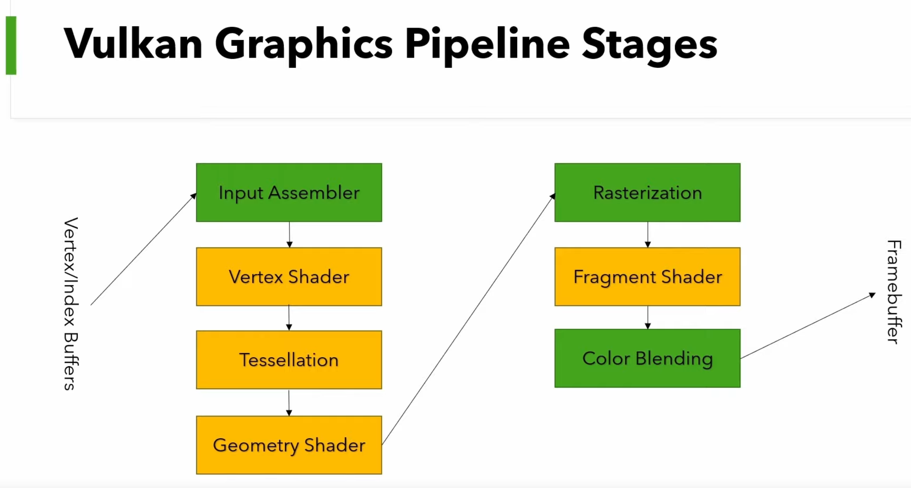
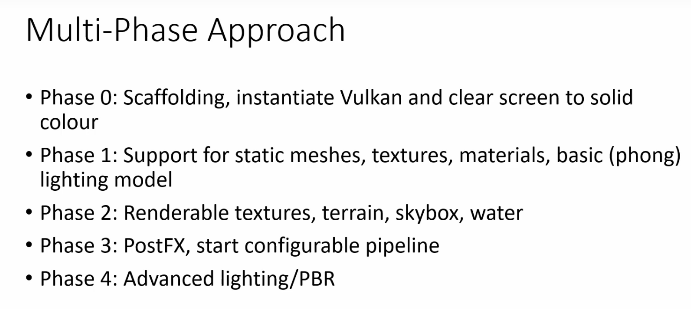
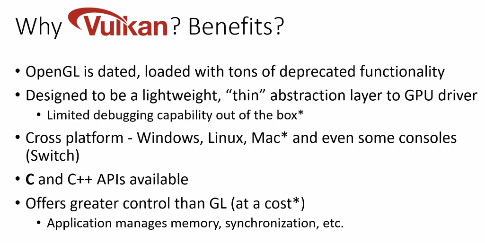
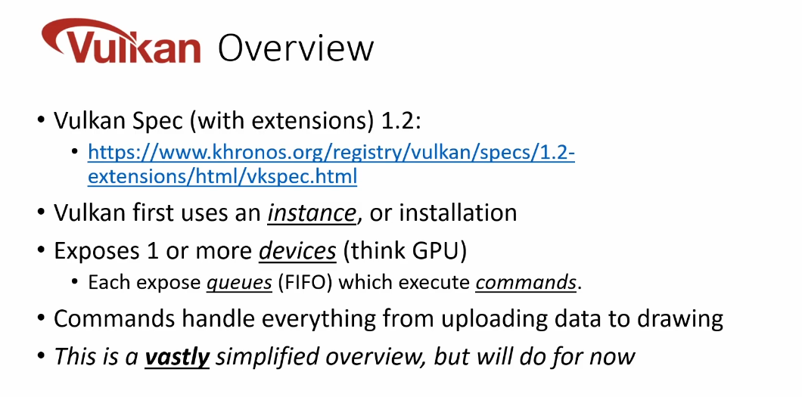
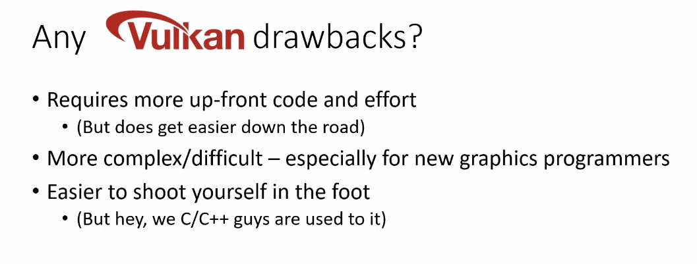
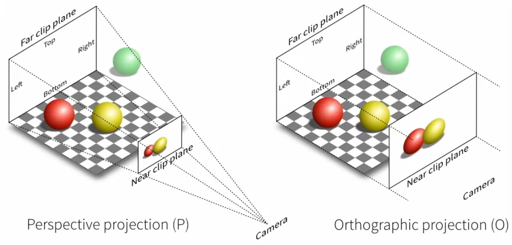

# Vulkan Game Engine

## Setup (Windows)
- Install: vscode
    - C/C++ extension
- Install: Visual Studio Community
    - Workload: Desktop development with C++
- (After VSCommunity) Install clang (https://llvm.org/builds/)
    - Check:
    ```
    $ clang --version
    clang version 12.0.0
    Target: x86_64-pc-windows-msvc
    Thread model: posix
    InstalledDir: C:\Program Files\LLVM\bin
    ```
- Install Vulkan SDK (https://www.lunarg.com/vulkan-sdk/)
    - Add `PATH` variable for all users
    - Check:
    ```
    >echo %VULKAN_SDK%                                                                                       C:\VulkanSDK\1.3.280.0 

    # or
    
    $ echo $VULKAN_SDK
    C:\VulkanSDK\1.3.280.0
    ```
- Install `make` for Windows (https://gnuwin32.sourceforge.net/packages/make.htm)
  - Set `PATH` -> `C:\Program Files (x86)\GnuWin32\bin`

## Setup (Linux)
- Install: vscode
    - C/C++ extension
- Install:llvm- clang
  ```
  $ sudo apt update && sudo apt upgrade -y
  $ apt search clang.*12
  $ sudo apt install clang -y
  ```
- Install Tarball Vulkan SDK (https://www.lunarg.com/vulkan-sdk/)
  - `$ tar -xvf ./vulkansdk-linux-x86_64-1.3.280.1.tar.xz`
  - Move: `~/vulkan/1.3.280.1/...`
  - `$ cd ~/vulkan/1.3.280.1 && source setup-env.sh`
- Install graphics libs: `$ sudo apt-get install libx11-dev libxkbcommon-x11-dev libx11-xcb-dev`
- Make scripts executable 
  ```sh
    $ chmod +x ./build-all.sh && chmod +x ./testbed/build.sh && chmod +x ./engine/build.sh
  ```

## VSCode shortcuts
- Shift + Alt + B - build
- F5 - Debug

## Definitions
- **Game engine** - is a software framework and suite of tools used to build and create video games
- **Kohi** - Japanese pronunciation for "coffee" 
- **CLang** - C language compiler which provides out-of-the box cross-platform compatibility (https://llvm.org/builds/).
- **Vulkan SDK** - is a set of tools and APIs to work with graphics (https://lunarg.com/vulkan-sdk/)
- **Stride** - size of an individual element inside dynamic array (in bytes)
- **Capacity** - number of elements that can be held
- **Length** - number of elements currently contained
- **Renderer Subsystem** - a software or hardware process that generates a visual image from model
- **Vulkan Pipeline** - a sequence of operations that take vertex data (positions, textures, etc.) and eventually output them as pixels on the screen.

## Game Engine Structure


## Feature list
- **Lightweight build system** - no CMake, fast build through .bash/.bat scripting
- **Low level utilities** - custom data structures, memory management, error handling, etc.
- **Platform layer**
- **Logger**
- **File I/O**
- **Application Layer**
- **Renderer / API abstraction Layer**
- **Memory management (allocators, etc)**
- **Scene-graph/ECS**
- **Profiling/Debugging utilities**
- **Scripting support via hot-reloading**
- **Physics**

## Engine Architecture


## Platform Layer


## Vulkan Graphics Pipeline Stages


## Renderer





## Viewport projections


## Git

- `git merge <hash> --no-commit --no-ff --allow-unrelated-histories`